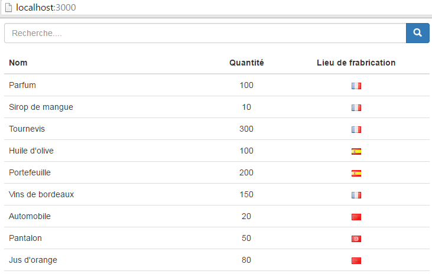

# React Isomorphic

Composant React affichant une liste de produits avec un champ de recherche. Le composant est utilisé côté client et côté serveur.

### Pré-requis

Installer [Git] et [Node.js]. 

### Installation

```sh
$ git clone https://github.com/oliv37/react-isomorphic.git react-isomorphic
$ cd react-isomorphic
$ npm install
```

### Lancement du projet

```sh
$ npm start
```

Ouvrir l'url **localhost:3000** dans votre navigateur.



### Librairies / Frameworks

* [React]
* [Node.js]
* [Express]
* [EJS]
* [Gulp]
* [Browserify]


   [React]: <https://facebook.github.io/react/>
   [Node.js]: <https://nodejs.org>
   [Express]: <http://expressjs.com>
   [EJS]: <http://www.embeddedjs.com>
   [Gulp]: <http://gulpjs.com>
   [Browserify]: <http://browserify.org/>
   [Git]: <https://git-scm.com/>